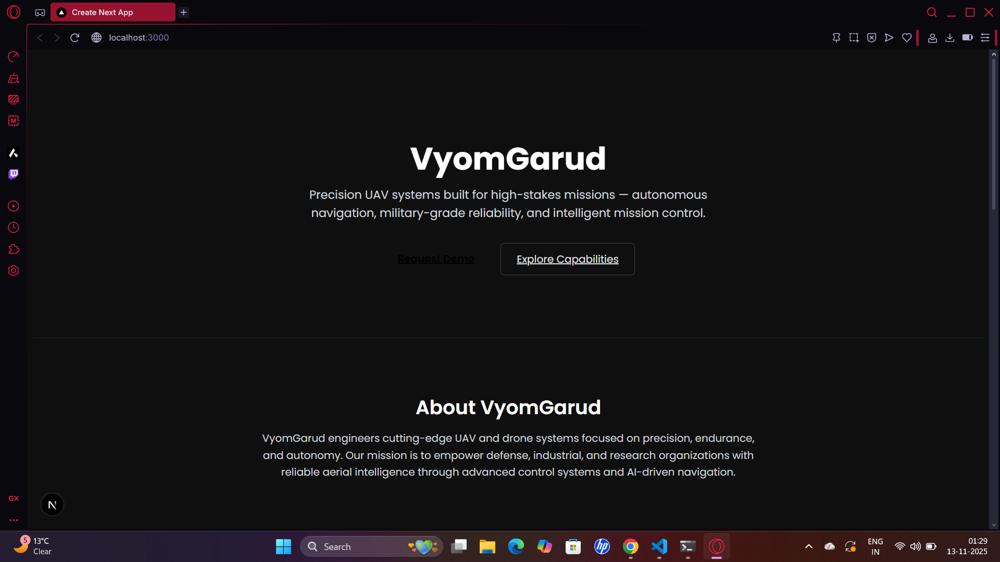
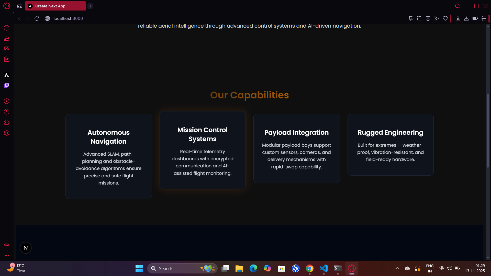
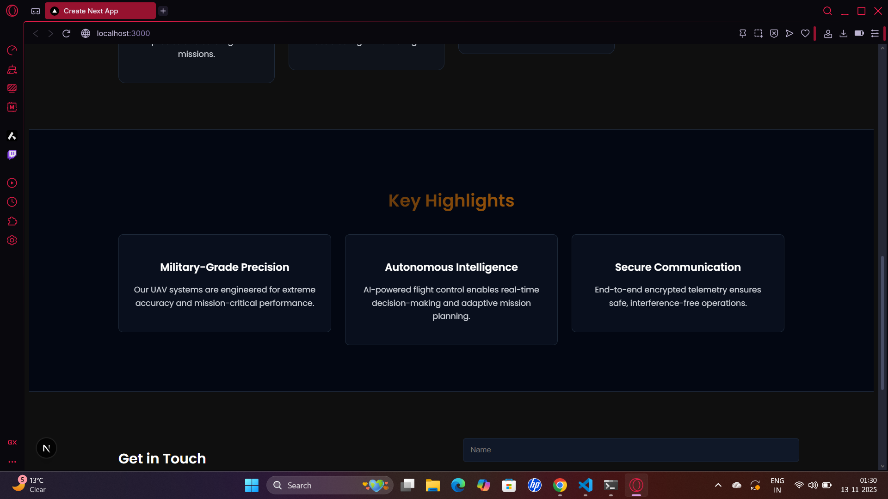

# 🚀 VyomGarud — Web Developer Internship Assessment  

A modern, responsive landing page for **VyomGarud**, a UAV and drone systems company specializing in high-reliability, precision navigation, and military-grade technology.  

This project demonstrates clean UI design, modular React components, and smooth animations — built using **Next.js**, **TypeScript**, and **Tailwind CSS**.  

---

## 🧩 Tech Stack  
- ⚡ **Next.js 16 (App Router + Turbopack)**  
- 🎨 **Tailwind CSS** for utility-first responsive styling  
- 🧱 **TypeScript** for strong typing and maintainability  
- 🎞️ **Framer Motion** for reveal and scroll animations  
- ☁️ **Deployed via Vercel**  

---

## 🧠 Sections Included  
1. **Hero** – Company name, tagline, and action buttons  
2. **About** – Mission statement and company overview  
3. **Capabilities** – Four feature cards explaining core technologies  
4. **Highlights** – Key strengths and advanced engineering features  
5. **Contact / Footer** – Contact details, simple form, and copyright notice  

---

## 🎨 Design Highlights  
- **Theme:** Dark, futuristic, and aerospace-inspired  
- **Color Palette:**  
  - Charcoal – `#0f0f0f`  
  - Accent Orange – `#ff7b00`  
  - White / Gray – for text and contrast  
- **Font:** [Poppins](https://fonts.google.com/specimen/Poppins)  
- **UI Details:** Subtle hover effects, rounded cards, and clean spacing for readability  

---

## 📸 Screenshots

### 🏠 Hero Section


### ⚙️ Capabilities


### 💡 Highlights


### ✉️ Contact


---

## ⚙️ Setup Instructions  
1. Clone the repository  
   ```bash
   git clone https://github.com/<your-username>/vyomgarud.git
   cd vyomgarud
